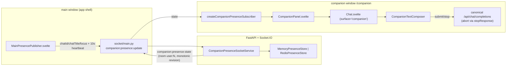

# Repository Guidelines

Tide-Bot is a private, branded deployment of [Open WebUI](https://github.com/open-webui/open-webui) for Changing Tides Treatment Center, served at `tide-bot.com`. Ted-Bot (the black goldendoodle) is the product mascot, not a separate app. This checkout is the `ted-bot-native-companion` worktree (branch `agent/ted-bot-native-companion`), which adds a two-window "native companion" feature: the main Tide-Bot window publishes chat presence over Socket.IO, and a `/companion` window renders a compact chat surface that follows the active conversation.

## Project Overview

- **Product:** Tide-Bot — a private, self-hosted work AI workspace derived from Open WebUI. SvelteKit frontend (`src/`) + FastAPI backend (`backend/open_webui/`).
- **Active work (this worktree):** Ted-Bot native companion — presence pub/sub, compact companion chat surface, isolated Cypress E2E acceptance. Current state: Task 5a (companion E2E coverage) passes end to end but is uncommitted/unreviewed. Pending: Task 6 (Tauri desktop shell), Task 7 (native action + release acceptance).
- **Production boundary:** Production deploys from the approved server/CI path via `deploy/tide-stack/` Compose overlays. The local Docker testing stack (`localhost:3102`) is dev/test only, not production. Never copy a local database, `.env`, logs, or user data into production.

## Architecture & Data Flow



- **Frontend request path:** SvelteKit component → `$lib/apis/<domain>/index.ts` async fn → `fetch(${WEBUI_API_BASE_URL}/..., { headers: { authorization: Bearer ${token} } })` → FastAPI router under `/api/v1/...` → `Depends(get_async_session)` → `models/<x>.<Table>` async classmethod → JSON.
- **Backend bootstrap:** `main.py` builds the `FastAPI` app; `lifespan()` boots the companion presence service + expiry task, then registers ~30 routers (`app.include_router(..., prefix='/api/v1/...', tags=[...])`, lines ~762–806). Socket.IO `sio` lives in `socket/main.py`.
- **Companion flow (two-window, socket-mediated):**
  - **Publisher** — `(app)/+layout.svelte` mounts `MainPresencePublisher` (skipped on the companion page). It builds a publisher via `createMainPresencePublisher` (`src/lib/ted-bot/presence.ts`), emits `companion:presence:update` with `{clientId, chatId, chatTitle, deviceLabel:'Tide-Bot Browser', isFocused, focusedAt}` plus a 10 s heartbeat. `clientId` persists in `sessionStorage`.
  - **Backend** — `socket/main.py` binds `companion:presence:update`/`companion:presence:subscribe` to `CompanionPresenceSocketService` (`socket/companion_presence.py`). `validate_presence_update` enforces field limits + chatId/chatTitle null-parity. Store is `MemoryPresenceStore` (single worker) or `RedisPresenceStore` (multi-worker, namespaced `<prefix>companion_presence:`). State emits as `companion:presence:state` to room `user:<id>` with a monotonic `revision`; TTL 30 s; an expiry loop reaps; `disconnect()` clears.
  - **Subscriber** — `/companion` builds `createCompanionPresenceSubscriber`, dedupes by `revision`, renews each heartbeat, sets `activeChatId`, and renders `<CompanionPanel chatId={activeChatId}>`.
  - **Surface** — `CompanionPanel.svelte` is a thin wrapper: `<Chat chatIdProp={chatId} surface="companion" />`. `Chat.svelte` skips Navbar, ChatControls, FilesOverlay, sidebar padding, and all `window.history.replaceState('/c/...')` when `surface==='companion'`; `MessageInput` switches to `mode='companion'` → `CompanionTextComposer.svelte`. Send reuses the canonical Chat completion path (no duplicate API client); Stop calls `stopResponse()` — **this is the abort**. Teardown destroys subscriber + socket listeners; publisher `destroy()` clears the heartbeat and publishes `isFocused:false`.

## Key Directories

- `src/routes/` — SvelteKit App Router. `(app)/` group holds authenticated UI (`+layout.svelte`, feature dirs: `companion/`, `workspace/`, `notes/`, `playground/`, `c/`, `channels/`, `folders/`, `automations/`, `calendar/`). Top-level: root `+layout.svelte`, `auth/`, `s/[id]/`, `watch/`.
- `src/lib/apis/` — ~30 API client modules, each `index.ts` exporting async token-bearing `fetch` wrappers (auths, chats, users, models, openai, ollama, tools, retrieval, knowledge, prompts, memories, notes, channels, configs, functions, files, folders, groups, evaluations, audio, images, automations, calendar, skills, terminal, streaming, analytics).
- `src/lib/components/` — feature-grouped Svelte components: `chat/`, `workspace/`, `layout/`, `common/`, `channel/`, `calendar/`, `notes/`, `playground/`, `icons/`, `ted-bot/`, `branding/`, plus `OnBoarding.svelte`.
- `src/lib/stores/` — classic `svelte/store` `writable<T>()` stores (`index.ts`: config, user, settings, models, socket, chatId, chatTitle, banners, toolServers; `chatList.ts`: chats/pinnedChats). Lowercase camelCase exports.
- `src/lib/utils/` — `index.ts` (helpers), `csp.ts`, `text-scale.ts`, `transitions/`, `marked/`.
- `src/lib/i18n/` — `index.ts` + `locales/`; consumed via `getContext('i18n')` + `$i18n.t('...')`.
- `src/lib/ted-bot/` — companion presence primitives: `presence.ts` (types + publisher/subscriber factories), `routes.ts` (`isCompanionRoute`), `presence.test.ts`.
- `src/lib/components/ted-bot/` — `CompanionPanel.svelte` + `.test.ts`, `MainPresencePublisher.svelte`, `TedBotPet.svelte` (sprite mascot) + `.test.ts`; `branding/TedBotMascot.svelte` wraps `TedBotPet`.
- `backend/open_webui/` — `main.py` (FastAPI app + lifespan + router registration), `config.py` (env/config + `DEFAULT_CONFIG` + migrations), `constants.py` (error/message enums), `env.py` (dotenv + `DATABASE_URL`/`REDIS_URL` + `ENABLE_*`/`WEBUI_*` flags), `internal/db.py` (async base/session dep).
- `backend/open_webui/routers/` — 31 router modules (auths, users, chats, channels, notes, models, knowledge, prompts, tools, skills, memories, folders, groups, files, functions, evaluations, configs, utils, terminals, automations, calendar, notifications, audio, images, ollama, openai, pipelines, retrieval, tasks, scim, analytics).
- `backend/open_webui/models/` — 26 SQLAlchemy 2 async model modules (table + Pydantic mirror + accessor classmethods).
- `backend/open_webui/utils/` — `middleware.py` (235 KB request pipeline), `auth.py` (JWT), `oauth.py`, `access_control/`, `payload.py`, `chat.py`, `response.py`, `redis.py`, `session_pool.py`, `security_headers.py`, `audit.py`, `asgi_middleware.py`.
- `backend/open_webui/socket/` — `main.py` (`sio`, session/usage pools, companion handlers, disconnect reaping) + `companion_presence.py` (service/stores/validators) + `utils.py` (`RedisDict`, `RedisLock`, `YdocManager`).
- `scripts/` — operational `.mjs` runners (see Important Files) + `prepare-pyodide.js`, `audit-branding.mjs`, `generate-sbom.sh`.
- `deploy/tide-stack/` — Tide-Bot Compose stacks + fixture images (see below).
- `docs/` — handoff records + the authoritative build/upstream specs.
- `.superpowers/sdd/2026-07-24-ted-bot-native-companion/` — SDD progress ledger (task briefs/reports/review diffs).

## Development Commands

```bash
npm ci                       # install frontend deps (engine-strict: Node <=22.x.x)
npm run dev                  # pyodide:fetch + vite dev --host (frontend on :5173)
npm run build                # pyodide:fetch + vite build -> build/
npm run check                # svelte-kit sync + svelte-check --tsconfig ./tsconfig.json
npm run lint                 # eslint --fix ; check ; pylint backend/
npm run format               # prettier --write (web files)
npm run format:backend       # ruff format . --exclude .venv --exclude venv
npm run audit:branding       # node scripts/audit-branding.mjs (gate before branding changes)
npm run test:frontend        # vitest --passWithNoTests
npm run test:companion:e2e   # node scripts/run-companion-cypress.mjs (needs RUN_ID env)
npm run i18n:parse           # i18next + prettier write on locale JSON
```

Backend:

```bash
cd backend && sh dev.sh      # uvicorn open_webui.main:app --port 8080 --reload
                            #   CORS_ALLOW_ORIGIN='http://localhost:5173;http://localhost:8080'
```

Docker:

```bash
cd deploy/tide-stack && docker compose up -d --build        # tide-bot:local, port 3102:8080
cd deploy/tide-stack && docker compose -f docker-compose.yml -f docker-compose.production.yml up -d --build  # production
sh docker-run.sh            # single-container local build/run (port 3000:8080)
make install | startAndBuild | stop | update                # convenience targets
```

Node `--test` runner scripts (no aggregate npm script — invoke each directly):

```bash
node --test scripts/run-companion-cypress.test.mjs
node --test scripts/run-companion-presence-redis-integration.test.mjs
node --test scripts/validate-ted-bot-pet.test.mjs
node --test scripts/verify-ted-bot-direction-evidence.test.mjs
```

## Code Conventions & Common Patterns

**Formatting** (enforced):
- Prettier (`.prettierrc`): tabs, single quotes, no trailing commas, 100-col width, LF endings, `prettier-plugin-svelte`.
- Ruff (`pyproject.toml`): 120-col, single quotes; lint select `E/F/W/I/UP/C90/Q/ICN` (mccabe max-complexity 10; `flake8-import-conventions` bans `ast`/`datetime` direct imports, aliases `datetime=dt`).
- Black: 120-col, `skip-string-normalization` (preserves single quotes).
- LF enforced everywhere via `.gitattributes`.

**Naming:** PascalCase `.svelte` components, camelCase TS/JS, snake_case Python. SvelteKit route files keep `+page.svelte`/`+layout.svelte` names.

**Frontend (Svelte 5 + Tailwind 4 + Vite 5):**
- Stores use classic `svelte/store` `writable<T>()` (interop with runes mode); reactive `$:` and `onMount`-returns-cleanup still appear. Props via `export let`.
- API clients: one `index.ts` per domain; async fns take `token: string` first, `fetch` with `Accept`/`Content-Type`/`authorization: Bearer ${token}`, `.then(r => { if (!r.ok) throw await r.json(); return r.json() })`, `.catch` sets `error` + `console.error` + returns `null`, then `if (error) throw error`. Base URLs from `src/lib/constants.ts` (`WEBUI_API_BASE_URL`, `OPENAI_API_BASE_URL`, `OLLAMA_API_BASE_URL`).
- i18n via `getContext('i18n')` + `$i18n.t('...')`; locale list drives `i18next-parser.config.ts`.
- Vite defines `APP_VERSION`/`APP_BUILD_HASH`; esbuild drops `console.log/debug/error` unless `ENV=dev`.

**Backend (FastAPI + SQLAlchemy 2 async):**
- `from __future__ import annotations`; `|` unions; Pydantic v2 (`field_validator`, `ConfigDict`).
- Routers: `APIRouter()`, `Depends(get_async_session)`, raise `HTTPException`.
- Models: `class X(Base)` table + `XModel(BaseModel)` mirror + `Xs` accessor with async classmethods taking `db: AsyncSession` (use `select`/`insert`/`update`/`delete` statements).
- Logging: `log = logging.getLogger(__name__)`.
- Config persistence: runtime config lives in `models/config.py:Config`; `config.py` holds `DEFAULT_CONFIG`, migrations, legacy import, seed/reset helpers.
- Auth: `utils/auth.py` JWT (`create_token`/`decode_token`/`get_verified_user`); `models/auths.py` uses `PLACEHOLDER_HASH` to mitigate timing attacks.

**Async / error handling:** backend is async throughout (async SQLAlchemy, async Redis, Socket.IO async handlers); `utils/middleware.py` is the request pipeline. Frontend API errors propagate via throw-after-catch so callers see structured backend errors.

**Dependency injection / state management:** FastAPI deps (`get_async_session`); Socket.IO session/usage pools in `socket/main.py`; Svelte stores for shared frontend state; companion presence state in the `PresenceStore` (memory or Redis) keyed by user.

## Important Files

**Entry points & config:**
- `backend/open_webui/main.py` — FastAPI app, lifespan (boots companion presence), router registration (~L762–806).
- `backend/open_webui/config.py` / `constants.py` / `env.py` — config + flags + error messages.
- `backend/open_webui/internal/db.py` — `Base`, `AsyncSessionLocal`, `get_async_session` dep, `get_async_db_context`.
- `src/app.html` (Tide-Bot splash/theme boot), `src/app.css` (`--tb-navy`/`--tb-ocean`/`--tb-aqua` vars), `src/tailwind.css` (Tailwind v4 entry), `src/lib/constants.ts` (`APP_NAME='Tide-Bot'`, base URLs).
- `package.json` (`name: open-webui`, `version: 0.10.2`, `type: module`, `engines`), `pyproject.toml` (Python build, `[project.scripts] open-webui = open_webui:app`), `hatch_build.py` (wheel build runs `npm install --force` + `npm run build`).
- `svelte.config.js` (adapter-static, fallback `index.html`, version via `git rev-parse HEAD`, 60 s poll), `vite.config.ts` (jsdom env for `TedBotPet.test.ts`, esbuild console drop), `cypress.config.ts` (NO `baseUrl` by design).

**Companion feature:**
- `src/routes/(app)/+layout.svelte` — companion-aware guards (`isCompanionPage` suppresses Sidebar/SettingsModal/ChangelogModal/keybindings); mounts `MainPresencePublisher`.
- `src/routes/(app)/companion/+page.svelte` — companion route; presence subscriber + `<CompanionPanel>`.
- `src/lib/ted-bot/presence.ts` — publisher/subscriber factories + socket event contract.
- `src/lib/components/ted-bot/CompanionPanel.svelte` — thin `<Chat surface="companion">` wrapper.
- `src/lib/components/chat/Chat.svelte` — canonical chat surface incl. `surface='companion'` branch.
- `src/lib/components/chat/MessageInput.svelte` + `MessageInput/CompanionTextComposer.svelte` — companion send/stop (stop = abort).
- `backend/open_webui/socket/main.py` + `socket/companion_presence.py` — presence service, stores, validator, expiry task.
- `backend/open_webui/routers/auths.py` — `/signup` + `signup_handler` (~L844): promotes the first user to admin and sets `ui.enable_signup = False` — **the sign-up UI is exercisable exactly once per isolated stack**.

**Tests:**
- `src/lib/shortcuts.test.ts` — canonical Vitest pattern (`describe`/`it`, fake `KeyboardEvent` stubs).
- `src/lib/components/ted-bot/CompanionPanel.test.ts` — source-contract test (`fs.readFile` + regex) locking no-duplicate-APIs + Chat reuse.
- `cypress/e2e/ted-bot-companion.cy.ts` — companion smoke spec (3 cases: anonymous redirect, compact-chrome single-stream abort, full-chat web-search confirmation denial).
- `scripts/run-companion-cypress.mjs` — hermetic isolated Cypress stack runner.
- `backend/open_webui/socket/test_companion_presence*.py` — pytest+pytest-asyncio presence authorization/store tests.

**Deploy fixtures (`deploy/tide-stack/`):**
- `docker-compose.yml` — base Tide-Bot stack (`tide-bot:local`, port 3102:8080, `WEBUI_NAME=Tide-Bot`, signup disabled).
- `docker-compose.cypress-companion.yml` — isolated E2E stack: `fake-openai` + `tide-bot` (zero egress) + `loopback-gateway` (only member of both internal `companion-cypress` and publishable `companion-cypress-ingress` networks).
- `cypress-loopback-gateway/` (Node `server.mjs`, credential-free TCP forwarder), `cypress-fake-openai/` (Node fake OpenAI fixture).
- `docker-compose.presence-integration.yml`, `docker-compose.terminal.yml` (`tide-terminal/`), `docker-compose.cptr.yml` (`cptr-gateway/` Python app), `docker-compose.production.yml`.
- `PRODUCTION.md`, `README.md`, `.env.example`.

**Docs:** `docs/BUILD_SPECIFICATION.md` (authoritative product brief), `docs/IMPLEMENTATION_PLAN.md` (active roadmap), `docs/UPSTREAM.md` + `docs/UPSTREAM_SYNC.md` (upstream baseline + sync procedure), `docs/BRANDING.md`, `docs/SECURITY.md`, `docs/TIDE_BOT_HANDOFF.md`, `docs/TED_BOT_NATIVE_COMPANION_HANDOFF_*.md` (per-session handoff records).

## Runtime/Tooling Preferences

- **Node 22.18.0 / npm 10.9.3 required.** `package.json` engines: `node >=18.13.0 <=22.x.x`; `.npmrc` sets `engine-strict=true` (rejects install otherwise). The shell-default Node 25 is **forbidden as acceptance evidence** — it violates engines. Dockerfile pins `node:22-alpine3.20`.
- **Python 3.11–3.12 only** (`requires-python >=3.11, <3.13.0a1`).
- **Never use `uv run` for focused tests** — it rewrites `uv.lock`. Use the existing venv or a throwaway `python -m venv`. (`uv` is only used inside Docker for `uv pip install --system`.)
- **ESM throughout** (`type: module`); `.eslintrc.cjs`/`tailwind.config.js`/`postcss.config.js` are intentional CJS exceptions.
- Frontend dev `:5173`, backend dev `:8080`; `backend/dev.sh` whitelists both in CORS.
- **Cypress config declares no `baseUrl` by design** — the companion runner injects a generated loopback origin via `CYPRESS_BASE_URL`. A bare `cypress run` cannot reach any live/user/production stack.
- The companion runner is hermetic: it rejects caller-supplied `COMPOSE_*`, `CYPRESS_BASE_URL`, `WEBUI_SECRET_KEY`, `OPENAI_API_*`, `DATABASE_URL`, `DEFAULT_MODELS`, `ENABLE_SIGNUP`, and forces `DOCKER_BUILDKIT=0` for offline fixture builds. Requires env `RUN_ID` (lowercase alnum + hyphens, ≤40 chars); use a fresh `RUN_ID` each run.
- `playwright==1.60.0` (backend, optional) **must match** `docker-compose.playwright.yaml`.
- `aiohttp` pinned to 3.13.5 (do not upgrade to 3.13.3 — broken); `torch<=2.9.1` and `pyarrow==20.0.0` pinned in Dockerfile for RPi compatibility.
- pre-commit runs `ruff --fix backend` + `ruff-format backend` only (frontend linting is via npm eslint).
- Pyodide is fetched into `static/pyodide/` before dev/build (`scripts/prepare-pyodide.js`); only `pyodide-lock.json` is tracked.

## Testing & QA

Three layers; **no quantitative coverage threshold** anywhere (no `vitest` coverage block, no `pytest --cov`/`addopts`). Exercise changed paths + critical auth/deploy flows.

**Vitest (frontend unit/contract):** `npm run test:frontend` (`vitest --passWithNoTests`, exits 0 with no matches). Tests co-located as `<name>.test.ts` (or `<name>.<aspect>.test.ts`). Reference style: `src/lib/shortcuts.test.ts`. jsdom tests opt in via `// @vitest-environment jsdom` + `@testing-library/jest-dom`; fake timers via `vi.useFakeTimers()`. **Source-contract tests** read sibling `.svelte` source with `fs.readFile` + assert structure — `CompanionPanel.test.ts`, `Chat.lifecycle-contract.test.ts`, `MessageInput.companion-contract.test.ts` lock the companion surface (single lifecycle binding, no duplicate `$lib/apis/*`, companion branch omits optional controls).

**Cypress (companion E2E):** `npm run test:companion:e2e` wraps the hermetic runner. Single spec `cypress/e2e/ted-bot-companion.cy.ts`:
1. anonymous `/companion` → redirects to `/auth`;
2. authenticated compact chrome + aborts exactly one slow upstream stream (`proxyRequestCount===1`, `aborted===true`, `completedCount===0`);
3. full-chat web-search confirmation denied before any completion (`proxyRequestCount===0`).

Wrapper-enforced invariants (verified by `scripts/run-companion-cypress.test.mjs`): project label `tedbot-companion-cypress-<RUN_ID>`, `compose up --no-build`, generated loopback origins, private env-file deletion, redacted request logs, `pre-existing-tide-bot-untouched` snapshot unchanged.

**Node `--test` runners** (invoke each directly):
- `run-companion-cypress.test.mjs` — guards the E2E wrapper (rejects caller-controlled env, asserts exact Compose argv, redaction, no-`baseUrl` config).
- `run-companion-presence-redis-integration.test.mjs` — presence-integration stack (internal network, `OFFLINE_MODE`, embedding bypass) + no-leak teardown.
- `validate-ted-bot-pet.test.mjs` — Codex v2 pet package validity (manifest, atlas paths, 1536×2288 WEBP, cell-size divisibility).
- `verify-ted-bot-direction-evidence.test.mjs` — Hatch Pet direction-evidence QA pipeline (blind-pair prepare/verify/combine/seal).

**Pytest (backend):** `test_companion_presence*.py` under `backend/open_webui/socket/`; `pytest.mark.asyncio` per test, `AsyncMock`/`fakeredis.aioredis.FakeRedis` for the store, `chat_access` authorization branches (owner/admin/grant/folder), cross-user rejection before any mutation, Redis revision monotonicity, orphan reaper ordering. No `[tool.pytest.ini_options]` in `pyproject.toml` — no `asyncio_mode`, no `testpaths`, no markers file.

**SDD ledger (evidence convention):** `.superpowers/sdd/<plan>/progress.md` logs task status; a task is "done" when its `task-N-report.md` + clean `review-<sha>..<sha>.diff` appear. Current: Task 5 complete, Task 5a in flight, Tasks 6–7 pending.

## Operational Guardrails

- `npm run check` carries a large inherited upstream diagnostic baseline — run changed-path diagnostics, focused tests, the branding audit, a production build, and `git diff --check`; report the global result without presenting inherited errors as a new regression.
- Run `npm run audit:branding` before any branding-adjacent change — it hard-gates Tide-Bot identity assets and forbids upstream "Open WebUI" labels/URLs across ~17 product-surface files.
- Never point Cypress at `localhost:3102`, the Tailscale site, production, a user database, or a user credential — only the runner-generated loopback origin.
- Never rebuild the frontend (`vite build`) while the isolated Cypress stack is up — it replaces `build/`, invalidating the container's read-only bind mount and 404-ing every route. The runner builds before `up`.
- Keep `tide-bot-pet/` and `teddy-v2-upgrade/` untracked/unmodified unless the user authorizes a change.
- Upstream syncs (Open WebUI) use the procedure in `docs/UPSTREAM_SYNC.md`: explicit release tags, reviewed commits, recorded in `docs/UPSTREAM.md`; never inherit upstream workflows, telemetry, public-signup defaults, or public terminal/CPTR exposure.
